# Sharif El Haloul (Arcade Building Club Website)

This is my Milestone 1 project. I have chosen a website that allows users to join or enquire about an Arcade machine building club. To keep it nice and simple I have created four simple pages where they can find out about the club and also book classes. I have used the bootstrap style mobile first design as it is becoming more and more common for users to be looking at the application using this device.

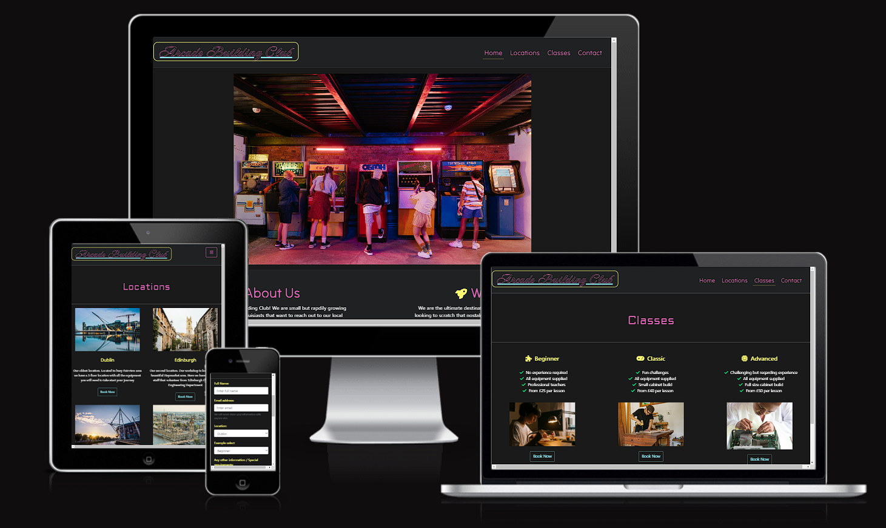

[Link to Arcade Building club live website](https://sharifelhaloul.github.io/Code-institute-Project-1/)


## Table of Contents

1. [Planning & Development](#planning--development)
2. [Features](#features)
3. [Testing](#testing)
4. [Deployment](#deployment)
5. [Languages](#languages)
6. [Media Queries](#media-queries)
7. [Software](#software)
8. [Code](#code)
9. [Credits](#credits)


# Planning & Development #

### Strategy

I wanted to create a website that put users first. Making sure that on every page there is a call to action that allows the user to get wherever they need to go. I have also created easy to access resources and links which makes the website more fluid.

### Target Audience

I wanted to target a wide variety of ages of people who have a keen interest in either classic gaming or building projects. My target audience for classic gaming will most likely be middle aged to younger users. Due to this, I needed to make sure that my web page is fully responsive and aesthetically pleasing.

### User stories 

1. Viewing the website to find out more information
2. Wanting contact details for more information
3. Wanting to find out locations that are available for classes
4. Wanting to book a class for themselves
5. Wanting to book a class for someone else

### Site Objectives

* An introduction to the club and what they do
* Display the locations that the club operates at
* Display the types of classes that the club has to offer
* Give the user a positive and fluid experience throughout the site
* Easy to navigate through the different pages
* Provide the users with contact information
* To provide accessibility for screen readers
* Links to social media and separate timetable pdf

### Approach

* The information provided on the site will be displayed in manner that fits with the research done prior to starting the project
* The site will be created following the principals of user experience design
* The site will be easy to navigate and clear for all user ages
* The site will provide information on club sites
* The site will provide costs of courses and other information
* The site will provide links to social media
* The site will provide pdf link to class timetable
* The site will provide a form for users to fill in for classes and enquiries

### Research

I conducted research into other Arcade style websites to see what colour palettes can be used and how they would structure their sites for easy navigation and a good user experience. Some of the sites I used were:

* [Arcade Club](https://www.arcadeclub.co.uk/)
* [Classic Arcade](https://www.classicarcade.co.uk/)
* [Arcade Mania](https://arcademania.co.uk/)

Insight gained from these websites:

* Colourful vibrant logo
* Neon colours used throughout the site
* Responsive fluid design
* Easy navigation using navigation bar
* Easy to find contact information
* Easy to find links to social media

All of the insight gained above has been utilised in my own site

### Wireframes

I started with the mobile version of my app and worked up to a desktop version. Here are examples of each device design that I came up with:

#### Mobile

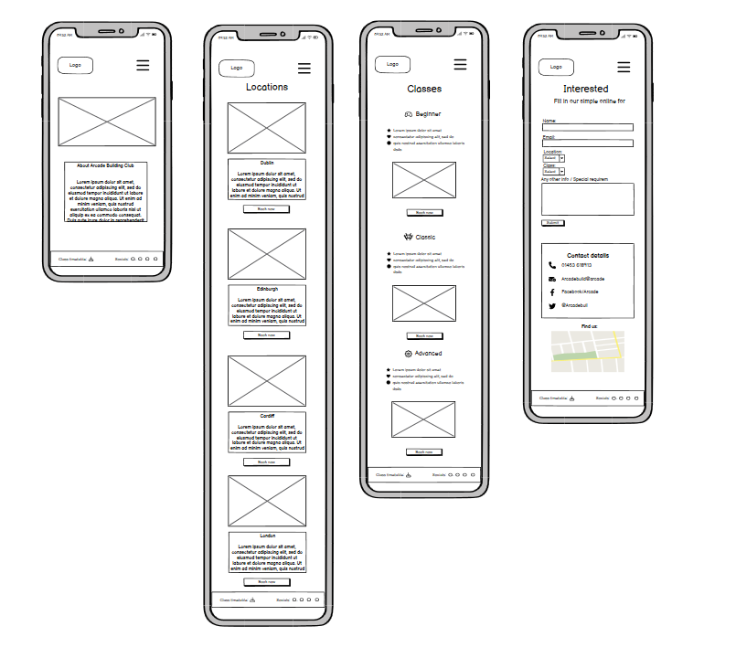

#### Tablet

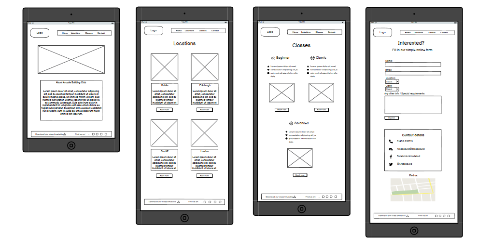

#### Desktop

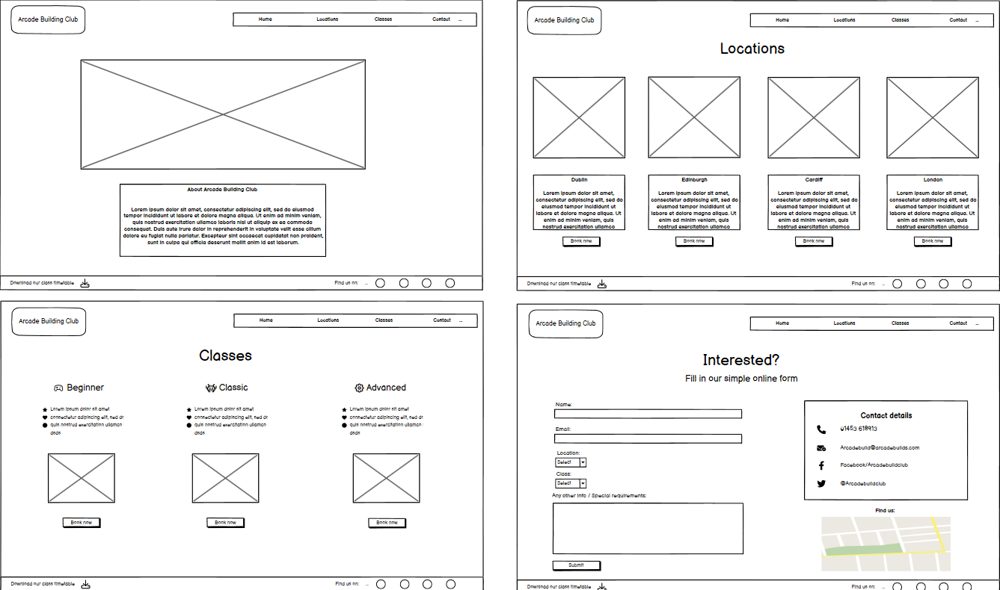

### Colour Scheme

Due to my research into similar sites and target audience, I decided to go with neon classic arcade colours. This aesthetic is used to appeal to younger users but also to give a nostalgic 80's arcade feel for the older dynamic. For the main colour palette I used the [My colour space](https://mycolor.space/?hex=%23845EC2&sub=1) website. I found the following colour pallette suited the majority of the site:

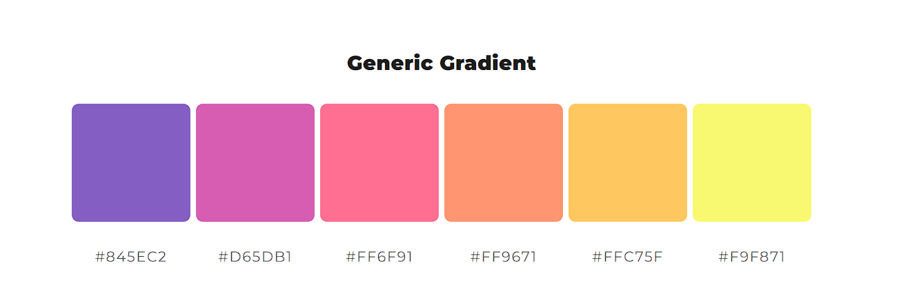

### Typography

Carrying on with the retro Arcade theme using Google Fonts I found the "Neanthderthaw" and "Tilt Neon" Fonts suited a "Game Over" style of writing that you would find on most classic Arcade games.

# Features

### General

* I have made the website fully responsive so that it can be used effectively on all device sizes
* I have made sure that the text is easily readable on all device due to the contrast in colours used

### Logo

I created the logo using a Neon style font that makes it look like an old sign used in most arcades. 

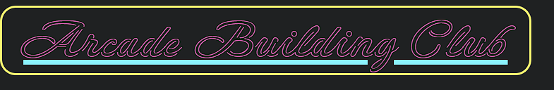

### Navigation Bar

I made sure that my navigation bar matched the rest of the pages colour palette and was fully responsive on all device sizes. I have also made sure that the navigation bar reduces to a burger style menu when on smaller devices. The navigation bar will consistently stay on the right hand of the screen on all devices. The navigation bar also has a neon blue tint when hovered over for an extra bit of appeal.

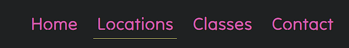

### Home page general

I created a homepage with one large hero image to immediately catch the attention of the user with colours that fit cohesively with the rest of the website. I also added an about section to make sure that the user is immediately made aware of what the club does without having to search too far for it. I added animated Icons to further add to the classic arcade game feel.

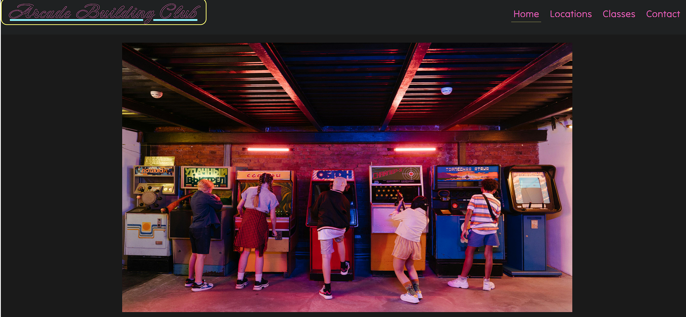

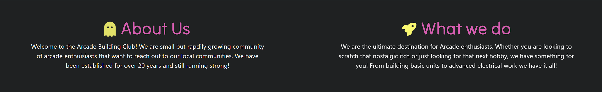


### Footer

Within my footer I made sure to include a copyright section to make the feel more realistic and professional. In the middle of the footer section a clickable link to a pdf document for class times in each location. On the right hand side I have included links to all social media pages. All links in the footer have a nice neon blue effect as you hover over them.

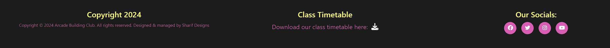

### Locations page

On the locations page I have include a nice grid format for the pictures that line up on large screen and scale down on smaller devices. The images zoom in slightly when hovered over. I have also included a 'book now" neon blue call to action button under each image so the user can be send to the form from any part of the page.

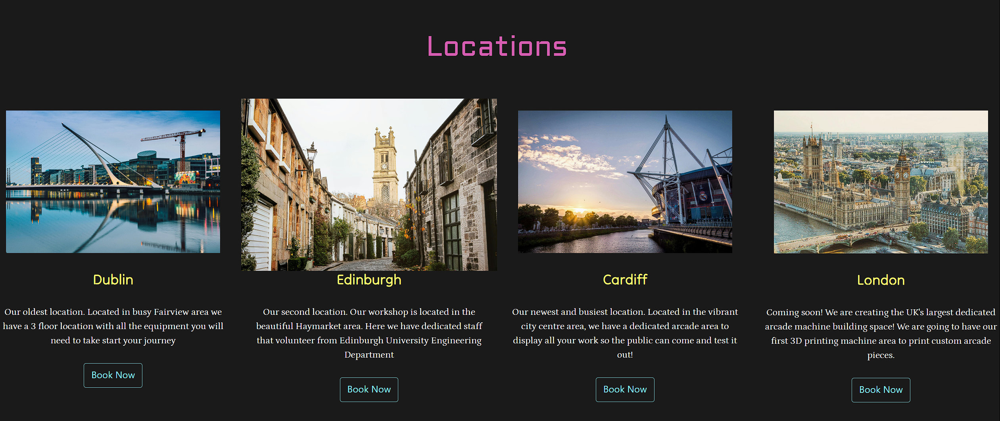

### Classes page

On the classes page I have matched the theme with the rest of the website using a grid like system which scales down dependant on the device. I have once again used 'book now' buttons under each class type to make sure the user can quickly and easily access the form. I have included specific icons which I believe tie in with the arcade theme

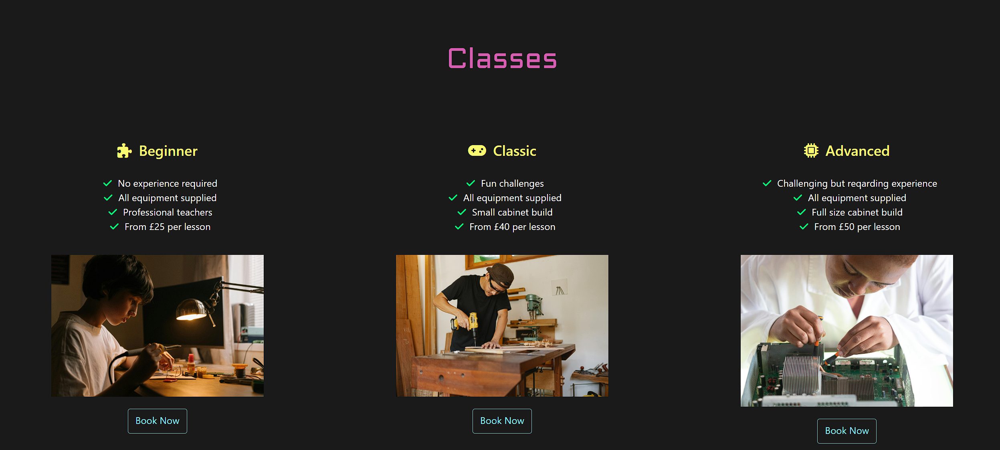

### Contact Page

On the contact us page I have made sure to include a bootstrap style form but styled it to fit in with the rest of the website. I have included multiple sections to fill in information. For better user experience, a warning message will appear unless they fill in certain information. On the right hand side of the page I have included easy to read contact details and a map location which adds more accessibility for the user.

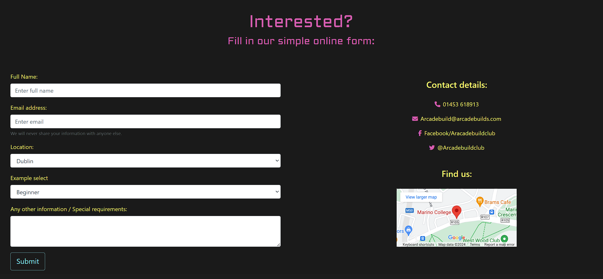

### Thank you page

On submission of a completed form, the user will open a new tab with thank you web page. The web page contains a celebratory image and a thank you message to let the user know we have received their information. This page matched thematically with the rest of the website

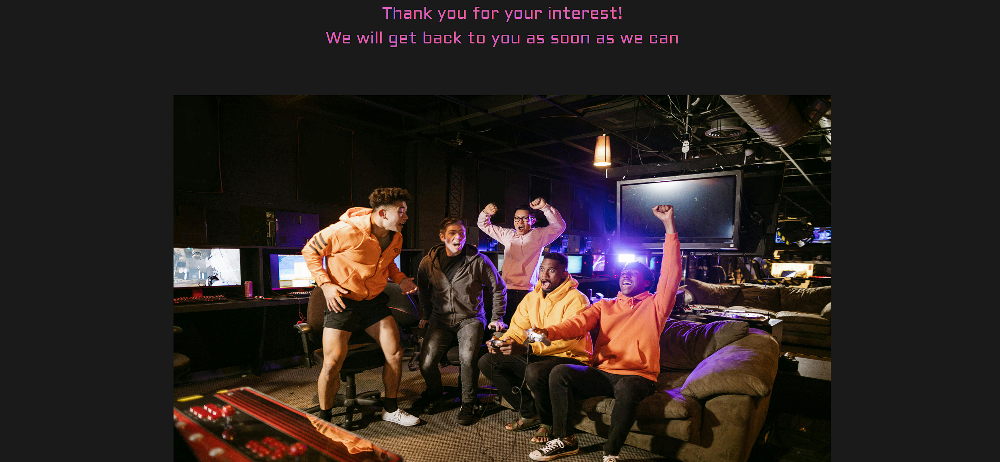

### Possible features for the future:

1. An embedded video showing some work being done in the arcade building club

2. A roulette style image wheel on the home page

# Testing #

## Testing during development

* Throughout the coding process I made sure to continuously test my code using the Chrome developer tool. I also used VS Codes preview window for smaller changes.

* I have made sure to push the code to Github multiple times to test and make sure that the website works on a live link using multiple devices.

* I have made sure to test my website on the main websites used today including Google Chrome, Mozilla Firefox, Safari and Microsoft Edge

## Testing element of my pages

* I made sure to test my logo and make sure it links back to the home page no matter what part of the site you are on

* I made sure to test my navigation bar and make sure it takes you to the correct page no matter where you are. I also wanted to make sure that it will highlight the current active page

* I tested all parts of the footer. I made sure that the pdf link opens in a different tab no matter where you are on the site. I also made sure that the social links open in separate browsers no matter where you are on the site.

* I made sure to test all the buttons on both the class and locations page to make sure that they take you straight to the form filling page.

* I made sure to test the form on the contact page and make sure it would request the correct information and would take you to thank you page only if all information needed was entered.

* I made sure to test the interactive map and make sure that it can be opened and displayed on any device

## Bugs found and solved during coding
1. Could not change colour of logos by targeting nav links due to bootstrap override:

```css
.nav-link a {
    color: #D65DB1;
}

```

as above I had to change to make sure to specifically target links to make sure colour actually changed.


2. I had figured out that I had two "active" classes in my HTML code which was solved quickly:

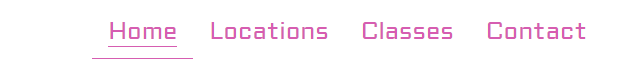

```HTML

 <ul class="nav justify-content-end" id="navigation-menu">
                        <li class="nav-link active">
                            <a class="active" href="index.html">Home</a>
                        </li>
```

3. Could not seem to centre align text in my divs that had bootstrap columns assigned to them no matter how specifically I targeted them. After much searching I found the bootsrap "text-center" class which fixed this:

```HTML

<div class="row text-center">
            <div class="col-md-6 col-lg-3" > 
                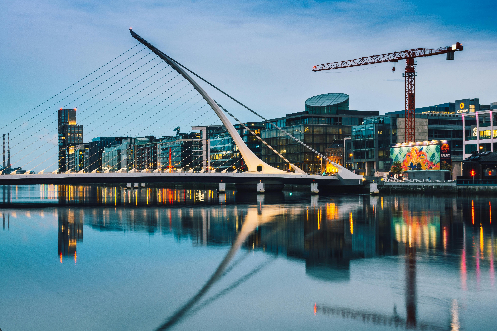

                <h4>Dublin</h4>

                <p>Our oldest location. Located in busy Fairview area we have a 3 floor location with all the equipment
                    you will need to take start your journey</p>

                    <button type="button" class="btn btn-outline-warning">Book Now</button>
```
4. 3rd picture in my classes page had a slightly bigger height than other images despite the img fluid class so to fix this I had to inspect the height of the other images on a large screen and set height of all images to 300 pixels so they all looked uniform on all screen sizes:

```css

.classes img {
    max-height: 300px;
}

```

before: 

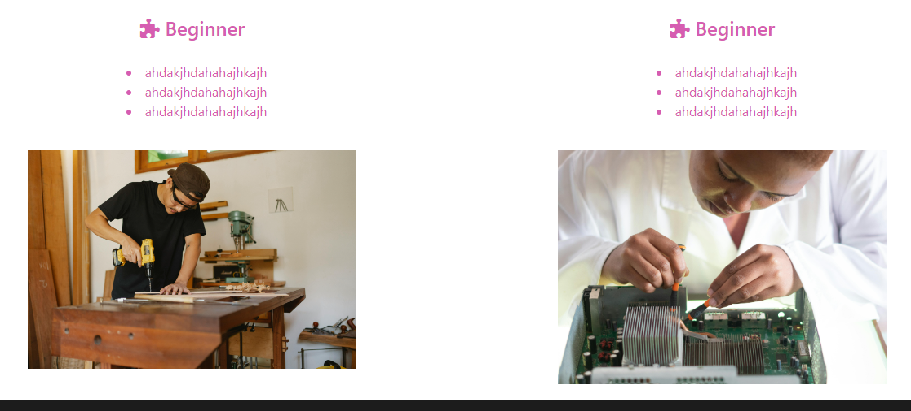

after:

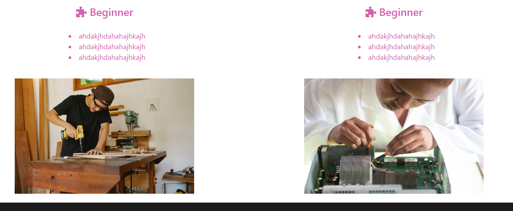

## code: 

## websites used:

fontjoy.com for font pairing

pexels.com for arcade images for website

fonts.google.com for fonts

# Validator testing #

I tested the home page on the W3 validator and had only one error:

* certain sections lack headers 

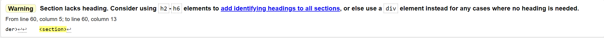

This is only due to the fact that I used sections instead of divs in certain locations which, according to my research, is fine

I then tested the locations, classes and contact pages on the w3 validator which returned the following errors:

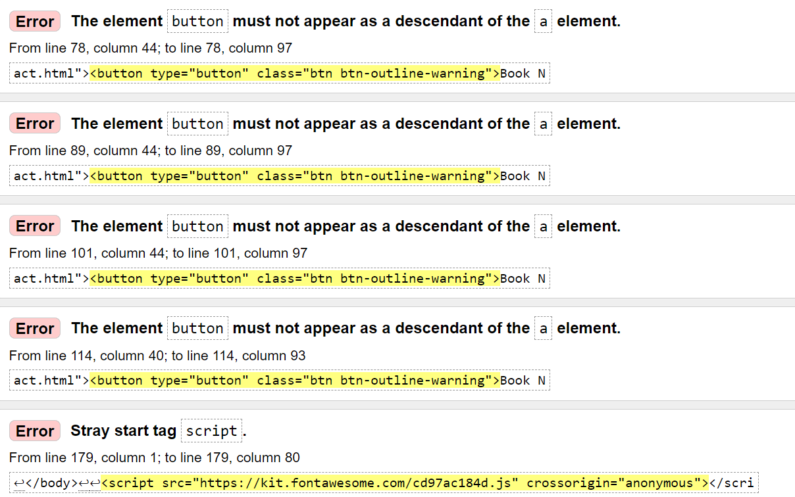

According to my research there is no immediate way around this if you want a button that links to another page without Javascript code. I attempted to just use an anchor tag and type of button but this still came up with an error.

I then tested my CSS on the CSS jigsaw site and came back with one error which was easily corrected by simply removing it:

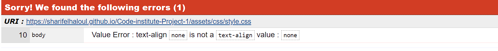

Here is the result after solving:

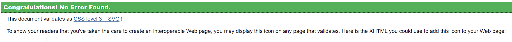

# Performance testing #

### Desktop

Tested the Desktop performance on Lighthouse and got the following result:

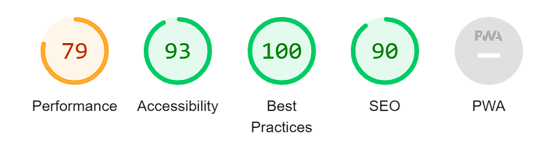

I can improve this score in the future by resizing the images and setting image sizes rather than keeping them flexible with img fluid property

### Mobile

Tested the Mobile performance on Lighthouse and got the following result:

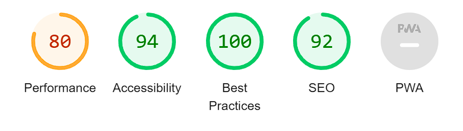

As above, I can improve this score slightly by resizing the images

# Deployment #

## Github pages

I used GitHub pages to deploy my site. This required me to go to my project repository and then:
1. Click on the 'Settings' tab.
2. Select 'Pages' from the menu that appears on the left.
3. Select 'Deploy from a branch'.
4. Select 'Main' in the drop-down menu called 'Select Branch'.
5. Then alongside 'Main', there is a folder dropdown where you select '/Root'.
6. Click 'Save' button.
7. Refresh the page and a link to the live project will appear at the top of the page.

## Forking a GitHub repository
Forking allows users to make a copy of an original repository in GitHub and view and make changes to it without changing the original repository.
To create a fork:
1. Once logged into GitHub, follow the link to your chosen GitHub repository, or use the search bar to find it on the GitHub home page.
2. Once in the repository window, click the 'Fork' drop down arrow button in the top right-hand corner.
3. Select 'Create new fork'.
4. Check the details in the window before clicking the green 'Create Fork' button.
5. You will now be able to find the copy of the repository in your own GitHub account.

## Making a Local Clone
1. Once logged into GitHub, follow the link to your chosen GitHub repository, or use the search bar to find it on the GitHub home page.
2. Once in the repository window, click the green 'Code' button.
3. To clone the repository using HTTPS, copy the link provided below the HTTPS header.
4. Open a terminal in your code editor.
5. Change the location in the current working directory to where you want the cloned directory to be created.
6. Type "git clone" into the terminal, and then paste the URL you copied and click enter.
7. This should have created a local clone of the repository.

# Languages #

* I used HTML and CSS for the main bulk of the website
* I also used Bootstrap Version 4.2 to help pad out and create a more user friendly site

# Media Queries #

I used media queries to override any bootstrap or code that was preventing my site being responsive and tidy on all devices

# Software #

* I used Visual Studio Code to create, edit, preview and push all of my code to my repository
* Git and Github for version control
* I used Balsamic for my wireframes and initial designs

# Code #

* Navigation bar was created using and tailoring elements of bootstrap
* Footer was created using and tailoring elements of bootstrap
* I followed along with the 'Love Running' Exercise for some other elements of the website whenever I got confused

# Credits #

* The three arcade themed websites mentioned earlier
* FontJoy for font pairings used
* Pexels.com For all images used

## Thanks to:

* Martina Terlevic my CI mentor whose advice was invaluable
* Manuel Perez Romero for his guidance and feedback during this time


